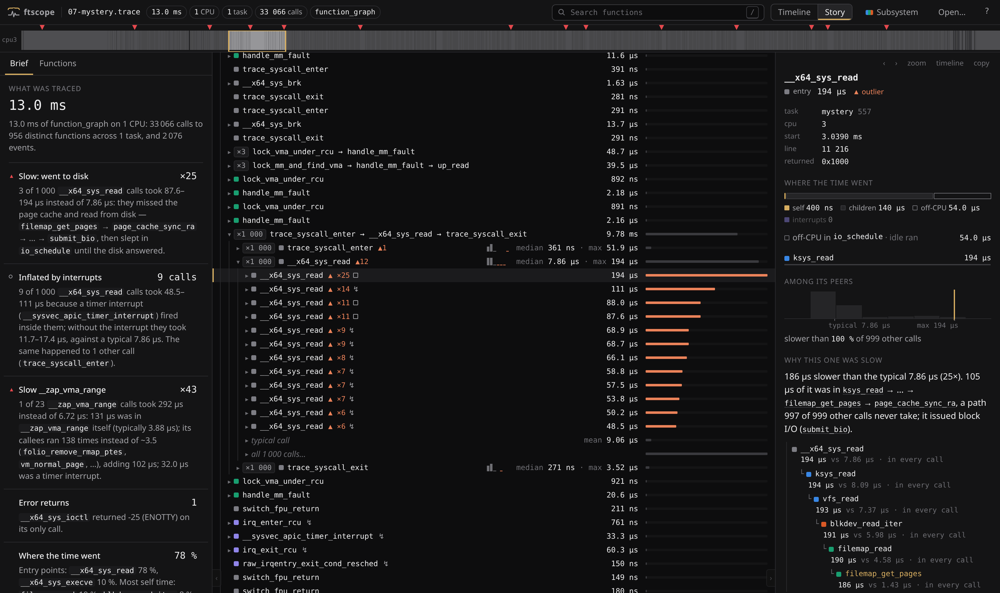
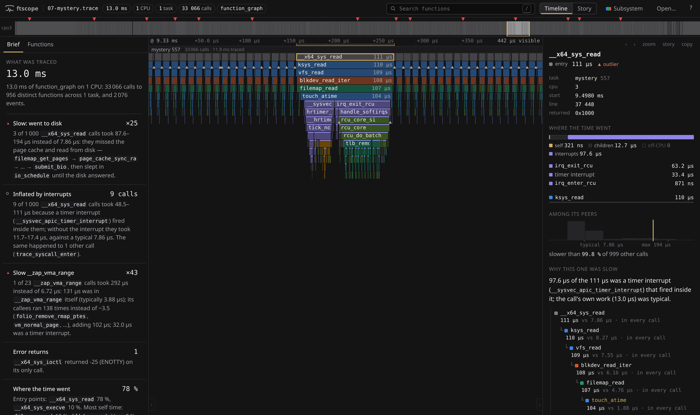
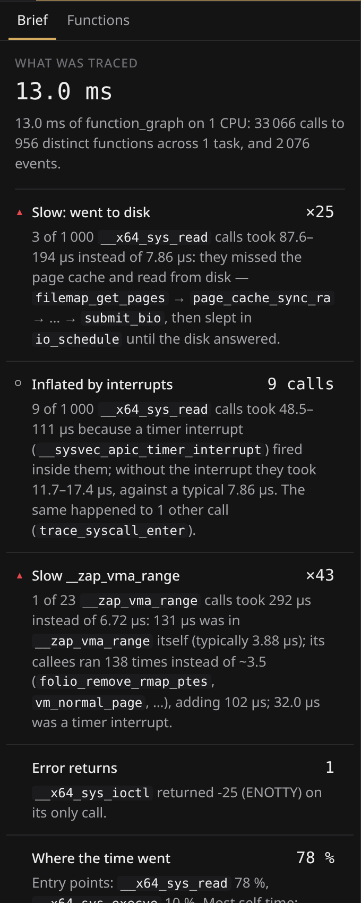
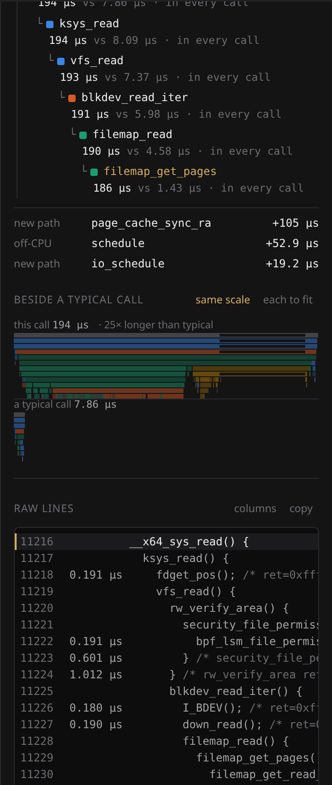

# ftscope

**A viewer for Linux ftrace output that reads the trace for you.** Drop a
`function_graph` trace on the page; it folds the repetition, finds the calls
that took far longer than their peers, and says why: went to disk, slept, hit
by an interrupt. Everything runs in your browser. Nothing is uploaded.

**Open it: <https://zahakj.github.io/ftscope/>** and press *A slow read, hiding
among a thousand*.



## Try it on your own machine in one minute

Record a trace of any command (needs root; restores your tracing settings when
it is done):

```sh
git clone https://github.com/ZahakJ/ftscope
cd ftscope
sudo ./tools/ftscope-record -- ls -l /usr/bin
```

That writes `ftrace.trace`. Open <https://zahakj.github.io/ftscope/> and drop
the file on it.

No network where the trace is? Save
<https://zahakj.github.io/ftscope/ftscope.html>: it is the whole viewer in one
file. Copy it anywhere, open it from disk, drop a trace on it.

Already have a trace? Any text that came out of `/sys/kernel/tracing/trace`,
`trace_pipe` or `trace-cmd report` works, plain or gzipped.

## What it does that a text viewer does not

An ftrace is a wall of text because it is almost all repetition. A trace of a
thousand `read()` calls prints the same 35 lines a thousand times, and the
three calls that matter are in there somewhere.

**It folds repetition.** A thousand consecutive reads are one row,
`×1 000 __x64_sys_read  median 7.86 µs  max 194 µs`, which opens into the
typical call and the unusual ones, by name.

**It compares every call with the other calls of the same function**, and
explains the slow ones. Not "this took 194 µs" but:

> 186 µs slower than the typical 7.86 µs (25×). It took
> `filemap_get_pages` → `page_cache_sync_ra`, a path 997 of 999 other calls
> never take; it issued block I/O (`submit_bio`) and slept in `io_schedule`.

**It accounts for time honestly.** A `function_graph` duration is wall-clock
time: it includes time asleep and any interrupt that fired inside the call.
ftscope splits every duration into self, children, off-CPU and interrupt time,
so a read that "took 111 µs" turns out to have taken 13, plus a timer interrupt
that happened to land on it.

**It shows you first what you would have gone looking for.** Opening a trace
starts on the *Brief*: what was traced, what was unusual and why, where the
time went, and whether the trace itself can be trusted (lost events, calls cut
off, no timestamps). Each line takes you to the place in the trace that proves
it, down to the raw lines.



| | |
| --- | --- |
|  |  |
| *The Brief: findings first.* | *The Inspector: where one call's time went, and why it was slow.* |

## The four views

- **Brief** — the findings, most important first.
- **Timeline** — one lane per task, calls nested downward, true time. Colour
  is kernel subsystem, or, with `c`, *surprise*: everything grey except calls
  that are slow among their peers. Time asleep inside a call is drawn hollow.
- **Story** — the same trace as a folded call tree, in the order it happened.
- **Inspector** — whatever is selected: the time split, where it stands among
  its peers, why it was slow, and the raw trace lines.

Keys: `/` search · `1` timeline · `2` story · `w` `s` zoom · `a` `d` pan ·
`f` fit selection · `0` fit all · `[` `]` previous / next call of the same
function · `o` next outlier · `c` colour mode · `?` help.

The address bar holds the selection and the view, so a link points at one call.

## Recording a good trace

`tools/ftscope-record` does this for you; by hand it is:

```sh
cd /sys/kernel/tracing
echo function_graph > current_tracer
echo funcgraph-abstime > trace_options    # timestamps: without them time is only estimated
echo funcgraph-proc > trace_options       # which task each line belongs to
echo 1 > events/sched/sched_switch/enable # so sleeping is not mistaken for work
echo 1 > tracing_on;  your-command;  echo 0 > tracing_on
cat trace > ~/my.trace
echo nop > current_tracer
```

Useful extras: `funcgraph-retval` and `funcgraph-args` (values on every line),
`set_graph_function` (only what happens below one function),
`set_ftrace_pid` (only one task), a larger `buffer_size_kb` when events are
lost.

## What it reads

| Input | Status |
| --- | --- |
| `function_graph`, every column and option combination of Linux 7.1 (`funcgraph-abstime`, `-proc`, `-cpu`, `-duration`, `-tail`, `-retval`, `-retval-hex`, `-args`, `-retaddr`, `latency-format`, bare) | tested on real traces |
| events inside a graph (`sched_switch`, `sys_enter`, `softirq_entry`, …), context-switch banners, `[LOST n EVENTS]`, traces that start or end mid-call | tested on real traces |
| `tracing_thresh` and `max_graph_depth` output | tested on real traces |
| `function` tracer (default, `noirq-info`, `noprint-parent`, `latency-format`) | tested on real traces; it has no durations, so you get order and frequency only |
| trace events alone | tested on real traces |
| `trace-cmd report` text | written from the documented format; not yet tested on real output |
| older kernels' `/* = 0x0 */` return values and `==========>` interrupt marks | written from the documented format |
| gzip | yes |
| binary `trace.dat` | no: run `trace-cmd report > file` first |

It has been run on traces up to 43 MB (310 000 calls): parsing takes about half
a second, and the timeline stays at 60 frames a second on half a million calls.
It keeps the whole text in memory, so the practical limit is a few hundred
megabytes.

## Where the example traces come from

`examples/traces/` are real captures of Linux 7.1.8, made by `lab/`: it boots
your distribution's own kernel image in a throwaway virtual machine (QEMU
inside a Docker container, KVM), runs a set of experiments as root in there,
and copies the traces out. Nothing on the host is traced, and no root is needed
on the host.

```sh
./lab/run.sh      # needs Docker and /dev/kvm; about 90 seconds
```

`examples/traces/README.md` says exactly how each file was made, and what the
right answer is for the one called *the mystery*. `lab/` is also how the
write-up of how ftrace works got its evidence:
**[ftrace](https://astrolabe.avicenna.space/Zombies/ftrace)**.

## Limits, honestly

- It reads text, not `trace.dat`.
- Without `funcgraph-abstime` there are no timestamps in a trace. ftscope then
  lays time out from the printed durations and says so; order and durations
  are right, gaps between tasks and CPUs are not.
- "Why was this slow" compares a call with other calls of the same function in
  the same trace. A function called fewer than eight times has no peers to
  compare with.
- Subsystem colours are guessed from function names.
- Under heavy tracing, interrupts mostly land inside the tracer's own hooks,
  and the text then prints them in odd places. ftscope puts them where the
  printed durations say they were; about 1 call in 20 000 in the large example
  cannot be reconciled and keeps a stretched duration.

## Building it

```sh
npm install
npm run dev            # http://127.0.0.1:5990
npm test
npm run build          # dist/  (what the site serves)
npm run build:single   # dist-single/ftscope.html, the whole viewer in one file
npx vite-node scripts/brief.ts some.trace   # the Brief, in the terminal
```

TypeScript, Preact for the panels, a canvas for the timeline, no other runtime
dependencies. `DESIGN.md` is the contract the code is held to.

MIT licence.
