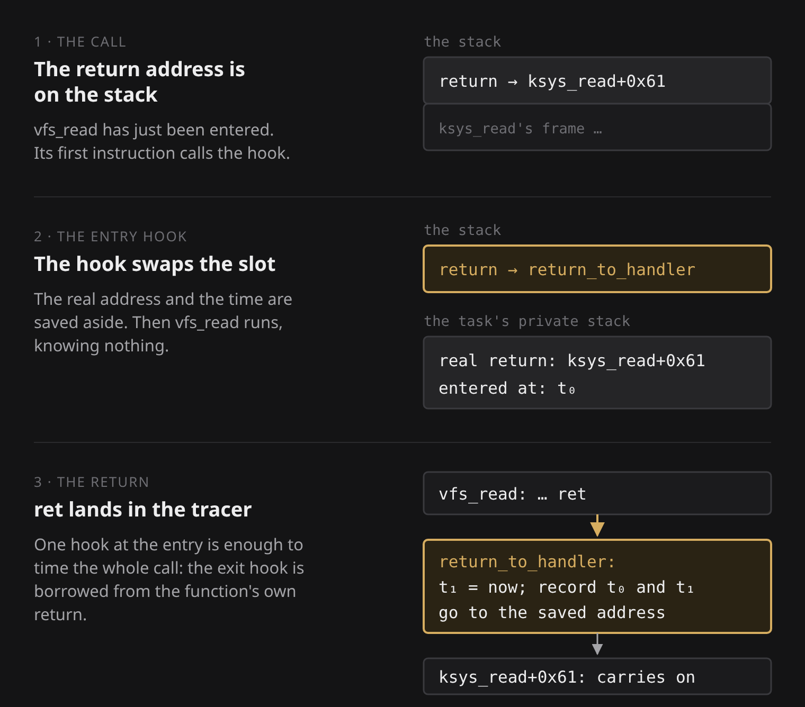
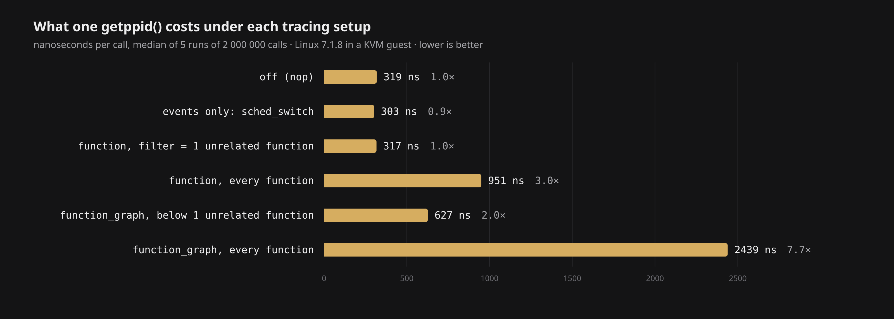
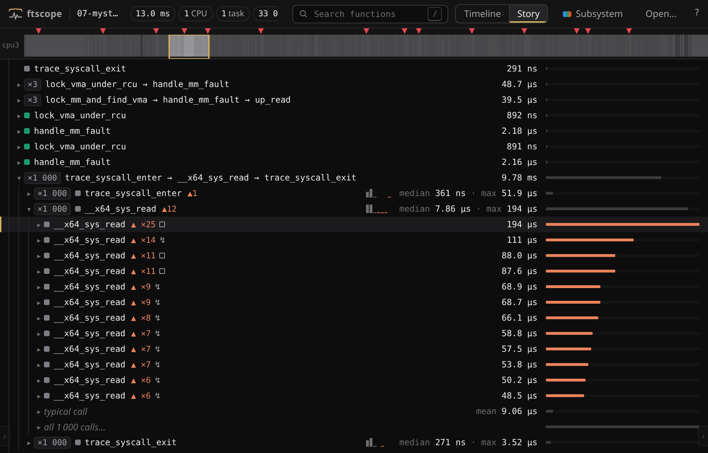
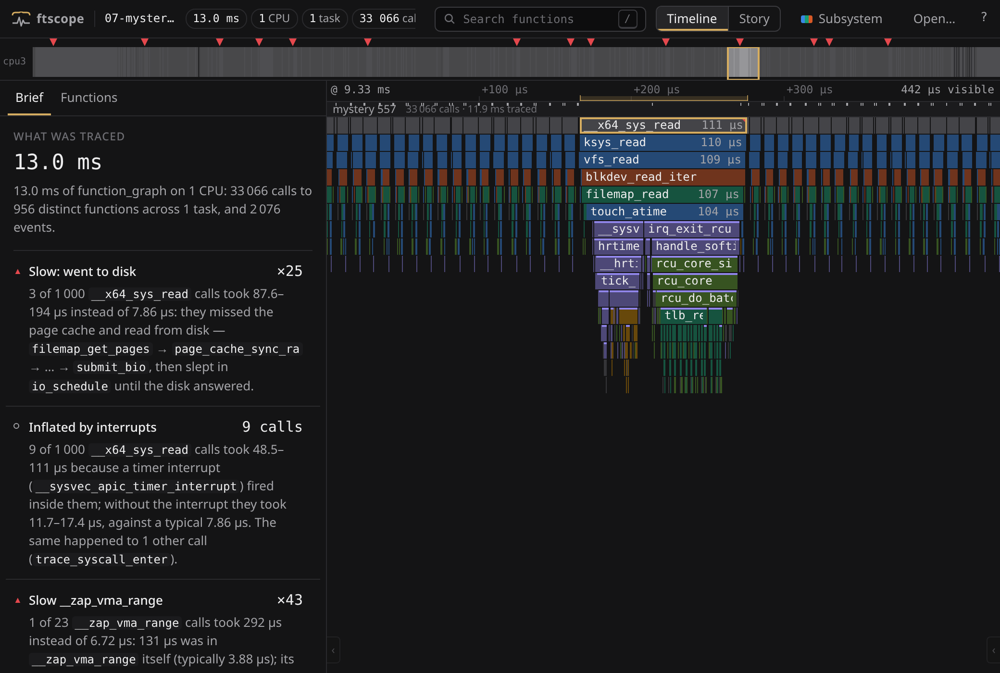

# ftrace

*Also published at <https://astrolabe.avicenna.space/Zombies/ftrace>. Everything quoted below was produced by [`lab/`](../lab) and is in [`examples/traces/`](../examples/traces).*

The kernel running on the machine I used for this note is made of 55,412 functions that can be traced. Some of them are running right now, thousands of times every millisecond, and you cannot see any of it. Suppose a `read()` that normally takes eight microseconds sometimes takes two hundred. In which of those fifty-five thousand functions did the time go?

You cannot casually stop a live kernel in a debugger: it is the thing running your debugger, your disk and your network. You can add a `printk` to the functions you suspect, rebuild, reboot, and learn that you suspected the wrong ones. What you actually want sounds impossible: a record of every function the kernel called, in order, with how long each one took, on a live system, switched on and off whenever you like, and costing nothing while it is off.

Linux has had exactly this since 2008. It is called **ftrace**, and it is compiled into nearly every distribution's kernel. This note builds it from nothing, because built from nothing it stops being a tool with eighty options and turns into four tricks, each one the fix for what was wrong with the step before. Every piece of output below is real, captured from Linux 7.1.8 running in a throwaway virtual machine, and the last section tells you how to run all of it yourself with one command.

## The dumbest thing that could work

Put a line at the top of every function:

```c
ssize_t vfs_read(struct file *file, char __user *buf, size_t count, loff_t *pos)
{
	hook();   /* "vfs_read was just called" */
	...
```

and have `hook` write down who called it. Do that to every function in the kernel, and the log that `hook` writes *is* the trace.

Three things are wrong with this plan:

1. Nobody is going to type fifty-five thousand hooks.
2. A call at the top of every function slows everything down, forever, whether or not anybody is reading the log.
3. The hook has to write its log somewhere, very fast, from anywhere, including from inside an interrupt handler that has just interrupted the hook itself.

ftrace is what you get when you fix those three, one at a time. Then a fourth trick, the best one, gets you the durations.

## Trick one: the compiler writes the hooks

Compilers have had a flag for this since the 1980s. It was made for the profiler `gprof`: compile with `-pg`, and the compiler inserts a call to a function named `mcount` into every function it compiles. The kernel uses the modern variant, `-pg -mfentry`, where the inserted call is to `__fentry__` and sits at the very top of the function, before the function has touched the stack.

On x86-64 that call is five bytes: the opcode `e8`, then a four-byte distance to jump. So every traceable function in the kernel begins with five bytes that belong to ftrace. A function that must never be traced (the hook itself, for one; think about why) is marked `notrace` and compiled without them.

The build does one more thing: it records the address of every one of those call sites in a table. Hold on to that table, because the next trick needs it. You can ask a running kernel how big it is. ftrace is controlled through the files of a special directory, `/sys/kernel/tracing`, and reading one of them answers the question:

```
# cat /sys/kernel/tracing/dyn_ftrace_total_info
55412 pages:224 groups: 3
ftrace boot update time = 8983799 (ns)
```

55,412 call sites, and 224 pages of memory to remember where they are.

## Trick two: the kernel rewrites itself

Now the cost. A kernel that calls a hook at the top of every function is slower at everything, even if the hook returns immediately. When Steven Rostedt posted the first version of this code in January 2008 he [measured it](https://lwn.net/Articles/265032/): a benchmark that took 2.22 seconds on a plain kernel took 2.53 with the hooks compiled in and nobody tracing. He called it 13%, for nothing. That is not acceptable for a feature that ships compiled in and idle on millions of machines.

The fix: don't call anything until someone asks. A `call` is five bytes. There is also a five-byte instruction that does nothing at all: `0f 1f 44 00 00`, a no-op. So while it boots, before anything interesting runs, the kernel walks the table of call sites and overwrites every single `call __fentry__` with the five-byte no-op. That is the "boot update time" in the output above: 9 milliseconds to defuse every hook in the kernel. From then on every function begins by doing nothing for five bytes.

To trace a function, the kernel writes the call back.

I did not want to take that on faith, so I looked. `/proc/kcore` lets root read the kernel's own memory as if it were a file. Here are the first sixteen bytes of `vfs_read` in the running kernel, with tracing off:

```
vfs_read  ffffffffad7b7500:  0f 1f 40 d6  0f 1f 44 00 00  48 81 ec 90 00 00 00
                                          └─ the no-op ─┘  └─ the function proper
```

(The first four bytes are another, unrelated no-op; see the footnote.[^1]) Now turn tracing on for that one function, by writing its name into one file and the name of a tracer into another:

```
# cd /sys/kernel/tracing
# echo vfs_read > set_ftrace_filter
# echo function > current_tracer
```

and read the same sixteen bytes again:

```
vfs_read  ffffffffad7b7500:  0f 1f 40 d6  e8 f7 8a c4 12  48 81 ec 90 00 00 00
                                          └── a call ───┘
```

The no-op has become `e8 f7 8a c4 12`. That is a call. A call to where? The four bytes after `e8` are a distance, least significant byte first, so `0x12c48af7`, measured from the end of the instruction. The instruction starts at `…7504` and is five bytes long, so it ends at `…7509`. Add them:

```
0xffffffffad7b7509 + 0x12c48af7 = 0xffffffffc0400000
```

and the kernel will tell you what lives at that address:

```
# cat enabled_functions
vfs_read (1)    tramp: 0xffffffffc0400000 (function_trace_call+0x0/0x1b0) ->function_trace_call+0x0/0x1b0
```

A *trampoline*: a few instructions the kernel generated on the spot, which save the registers and call the tracer's hook, `function_trace_call`. The neighbours were not touched. `ksys_write`, five kilobytes further on, still starts with the no-op. Set the tracer back to `nop`, and `vfs_read` starts with `0f 1f 44 00 00` again.

So "tracing is on" is not a flag that some code checks. There is no `if (tracing)` anywhere inside `vfs_read`. When you trace the kernel, it becomes a different program. Everything about what ftrace costs follows from that one fact, and further down we will test it with a stopwatch.

> **How do you overwrite an instruction that another CPU might be executing at this very instant?** A CPU that has read two of the old five bytes and then gets three new ones executes garbage. The kernel does it in three steps. First it writes one byte, `cc`, the breakpoint instruction, over the first byte. One byte cannot be half-seen. Any CPU that arrives now traps, and the trap handler does by hand what the new instruction will do once it is finished. Then the kernel writes the other four bytes, which sit behind the breakpoint where nothing can be executing them. Then it replaces the breakpoint with the new first byte. After each step it makes every CPU pass through a synchronisation point, so that no CPU is still holding stale bytes.

## Trick three: a notebook for every CPU

The hook needs somewhere to write. It may be called millions of times a second, on every CPU at once, and from inside interrupt handlers. An ordinary lock would be a disaster twice over: all the CPUs would queue up behind it, and an interrupt that arrives while its own CPU holds the lock would wait for itself forever.

So each CPU gets its own buffer, and CPUs never meet. Within one CPU the only rivals are interrupts, which can cut in at any instruction (and be cut into themselves). The buffer is written so that they can, and every writer still ends up with an intact record, with no lock anywhere. It is a ring of pages: when it is full, new records overwrite the oldest ones.

A record is tiny, because nothing is formatted when it is written. For the function tracer it is a four-byte header, which holds the time *since the previous record* rather than a full timestamp; eight bytes of context (the pid, whether interrupts were off, and so on); the address of the function; the address of its caller. Twenty-eight bytes. You can check:

```
# cat per_cpu/cpu0/stats
entries: 7256
bytes: 204168
```

204168 / 7256 = 28.1. (The extra tenth is a small header on each page, and now and then a full timestamp.)

No names and no strings: two addresses and a clock. The text you read later is produced only when you `cat` the trace file, by looking the addresses up in the kernel's symbol table. That is why the hook is cheap. It is also why a trace is such a wall of text: nothing was summarised on the way in, either.

And when the buffer wraps before you have read it, the oldest records are simply gone. There are two ways to read: the file `trace` shows what is in the buffer and leaves it there; `trace_pipe` is a live stream that removes records as you read them. Shrink the buffer to 8 KB per CPU, read `trace_pipe` while the system is busy, and the kernel admits what happened:

```
   multitask-468     [001] .....    24.521869: pte_offset_map_lock <-filemap_map_pages
CPU:3 [LOST 1885 EVENTS]
      <idle>-0       [003] d.s2.    24.522407: _raw_spin_unlock <-rq_unlock_irqrestore
```

## What three tricks buy you: the `function` tracer

This is a complete session. `current_tracer` chooses which hook gets patched in; `tracing_on` is only a valve on the buffer, so that you can record exactly the stretch you care about.

```
# cd /sys/kernel/tracing
# echo function > current_tracer
# sh -c 'echo $$ > set_ftrace_pid; echo 1 > tracing_on; exec cat /proc/version'
# echo 0 > tracing_on
# cat trace
```

(The third line is a trick of its own. `set_ftrace_pid` makes the hook ignore every task but one. The shell writes its *own* pid there, opens the valve, and then turns into `cat` with `exec`, which keeps the pid. So `cat` is traced from its first instruction and nothing else is.)

This is `cat` opening its file, as the kernel saw it:

```
#           TASK-PID     CPU#  |||||  TIMESTAMP  FUNCTION
#              | |         |   |||||     |         |
             cat-170     [002] .....     2.334375: __x64_sys_open <-do_syscall_64
             cat-170     [002] .....     2.334375: do_sys_openat2 <-__x64_sys_open
             cat-170     [002] .....     2.334375: getname_flags <-do_sys_openat2
             cat-170     [002] .....     2.334376: do_getname <-do_sys_openat2
             cat-170     [002] .....     2.334376: kmem_cache_alloc_noprof <-do_getname
             cat-170     [002] .....     2.334376: __check_object_size <-strncpy_from_user
             cat-170     [002] .....     2.334376: check_stack_object <-__check_object_size
             cat-170     [002] .....     2.334376: is_vmalloc_addr <-__check_object_size
             cat-170     [002] .....     2.334376: __virt_addr_valid <-__check_object_size
             cat-170     [002] .....     2.334376: __check_heap_object <-__check_object_size
             cat-170     [002] .....     2.334377: get_unused_fd_flags <-do_sys_openat2
             cat-170     [002] .....     2.334377: alloc_fd <-do_sys_openat2
             cat-170     [002] .....     2.334377: _raw_spin_lock <-alloc_fd
             cat-170     [002] ...1.     2.334377: _raw_spin_unlock <-alloc_fd
```

Read one line from left to right: the task (`cat`, pid 170); the CPU it was on; five characters of state; seconds since boot; the function, and after `<-` the function that called it. (The `1` in the state of the last line is the preemption count, the kernel's tally of reasons it must not be switched out right now. Holding a spinlock is one.)

Where does the caller come from? Not from any bookkeeping. At the first instruction of a function, the top of the stack holds the return address: the place in the caller to go back to. The trampoline just reads it. That is the entire price of knowing who called you, and it explains two odd lines above.

`__check_object_size` was called by `strncpy_from_user`, a function that never appears as a line of its own. The caller is whatever code physically contains the return address, whether or not that code is traced.

And `do_getname` claims to have been called by `do_sys_openat2`, when it was plainly called by `getname_flags`, the line before it. `getname_flags` ended with a *jump* to `do_getname` instead of a call (a tail call: nothing was left to do afterwards, so the compiler did not bother coming back). A jump pushes no return address. The one on the stack was still the one into `do_sys_openat2`.

Now look at what is missing. You cannot tell how long anything took. You cannot even tell where a function *ended*. The compiler put one hook in each function, at the top. A function trace is a list of beginnings.

## Trick four: steal the return address

How would you find out when a function returns, if your only hook is at its entry?

Think about what the hook can see. At entry, the return address is sitting on top of the stack, and the last thing the function will ever do is jump to whatever is in that slot. So change what is in the slot.

That is the `function_graph` tracer. Its entry hook does two things. It copies the real return address onto a small private stack that every task carries for exactly this purpose, along with the current time. Then it overwrites the slot on the real stack with the address of a function of its own, `return_to_handler`. The traced function then runs, knowing nothing. When it finally executes `ret`, it "returns" into `return_to_handler`, which reads the clock again, pops the private stack, writes both times into the ring buffer, and goes to the real return address. The caller never notices that anything happened.



Here is the same `open()` as before, through this tracer:

```
# echo function_graph > current_tracer
```
```
# CPU  DURATION                  FUNCTION CALLS
# |     |   |                     |   |   |   |
 0)               |  __x64_sys_open() {
 0)               |    do_sys_openat2() {
 0)               |      getname_flags() {
 0)               |        do_getname() {
 0)   0.210 us    |          kmem_cache_alloc_noprof();
 0)               |          __check_object_size() {
 0)   0.151 us    |            check_stack_object();
 0)   0.150 us    |            is_vmalloc_addr();
 0)   0.151 us    |            __virt_addr_valid();
 0)   0.150 us    |            __check_heap_object();
 0)   1.492 us    |          }
 0)   2.254 us    |        }
 0)   2.596 us    |      }
   …
 0) + 36.228 us   |  }
```

A brace opens when a function is entered and closes when it returns; the duration is printed on the closing line. A function that called nothing traceable is folded onto one line, `name();`. A `+` marks anything over 10 µs, `!` over 100 µs, `#` over a millisecond.

This is the output people mean when they say "an ftrace". Knowing how it is made, you can predict three odd things about it.

**A duration is the time between two events, and nothing more.** It is not CPU time. If an interrupt arrives while the function is running, the handler's functions have hooks too; they are traced on the same task, nested *inside* whatever they interrupted, and their time is included in everything above them:

```
 3)  mystery-557   |               |      vfs_read() {
 3)  mystery-557   |               |        rw_verify_area() {
   …
 3)  mystery-557   |   0.811 us    |        } /* rw_verify_area ret=0x0 */
 3)  mystery-557   |               |          irq_enter_rcu() {
 3)  mystery-557   |   0.220 us    |            irqtime_account_irq(); /* ret=0x0 */
 3)  mystery-557   |   0.652 us    |          } /* irq_enter_rcu ret=0x0 */
 3)  mystery-557   |               |          __sysvec_apic_timer_interrupt() {
 3)  mystery-557   |               |            hrtimer_interrupt() {
   …
 3)  mystery-557   | + 22.442 us   |            } /* hrtimer_interrupt ret=0x1 */
 3)  mystery-557   | + 22.833 us   |          } /* __sysvec_apic_timer_interrupt ret=0x1 */
 3)  mystery-557   |               |          irq_exit_rcu() {
   …
 3)  mystery-557   | + 11.381 us   |          } /* irq_exit_rcu ret=0x0 */
 3)  mystery-557   |   0.161 us    |          raw_irqentry_exit_cond_resched(); /* ret=0x0 */
 3)  mystery-557   |               |        blkdev_read_iter() {
   …
 3)  mystery-557   | + 47.489 us   |      } /* vfs_read ret=0x1000 */
```

`vfs_read` did not call `hrtimer_interrupt`. A timer went off on that CPU while `vfs_read` happened to be running, and 35 µs of somebody else's work landed in its total: this `vfs_read` took 47.5 µs where its neighbours take 8. In the same way, if the task goes to sleep in the middle of a function, the clock keeps running until it comes back.

(Look at the indentation of the interrupt's lines: one level too deep, with no opening line above them. The interrupt arrived at the instant the tracer was recording the entry of `blkdev_read_iter`. The hook had already counted the new level and had not yet written the line. That is not a coincidence. When every function is traced, the tracer's own hooks are where the CPU spends most of its time, as the measurements below will show, so that is where interrupts tend to land.)

**Nesting belongs to the task, not to the CPU.** The private stack of return addresses is per task. So when the scheduler changes tasks on a CPU, the output on that CPU continues in the middle of a different task's call stack:

```
 ------------------------------------------
 2)     wc-457     =>     ls-436
 ------------------------------------------

 2)               |          finish_task_switch.isra.0() {
 2)   0.190 us    |            ktime_get();
   …
 2)   2.104 us    |          }
 2) # 9504.656 us |        } /* schedule */
```

That closing brace closes a `schedule()` that task 436 entered 9.5 milliseconds earlier, possibly on another CPU. Nothing took 9.5 ms to compute. The task was asleep.

**It costs more than twice what the function tracer costs.** Two records per call instead of one, and a hijacked return on top. Which is something we can measure. But first, one more kind of hook.

## The hooks somebody wrote by hand

The compiler's hooks say "this function was called" and nothing else. At a few thousand places the kernel's authors wanted more than that, and wrote a hook by hand that records chosen values: in the scheduler, "switching from this task to that one, and the old one is going to sleep"; at the system call door, "call number 0, with these arguments". These are *tracepoints*, and the records they write are called *events*.

They use the same two ideas. A tracepoint that is switched off is a no-op in the code, patched into a jump when you enable it (`echo 1 > events/sched/sched_switch/enable`). And they write into the same ring buffer, so they come out interleaved with the function calls, in order. Inside a graph trace they print as comments:

```
 3)  mystery-557   |               |  /* sys_enter: NR 0 (4, 7fd94c775280, 1000, 0, 0, 0) */
```

That one says: system call number 0, which is `read`, on file descriptor 4, into a buffer at that address, 0x1000 bytes. We will need the scheduler's events later.

## One call, end to end

Before measuring anything, here is the whole machine in one place. Tracing is on, and some task calls `vfs_read`:

1. The `call` at `…ad7b7500` reaches `vfs_read`. Its first five real bytes used to be a no-op. They are now `e8 f7 8a c4 12`, so the CPU calls the trampoline at `…c0400000`.
2. The trampoline saves the registers, reads the return address off the stack to learn the caller, and calls the tracer's hook.
3. The hook writes a record of a few dozen bytes, two addresses and a time, into the current CPU's ring of pages. No lock, no text.
4. If it is the graph tracer, the hook also saves the return address and the time on the task's private stack and plants `return_to_handler` in its place.
5. `vfs_read` runs. Every function it calls goes through steps 1 to 4.
6. `vfs_read` returns, into `return_to_handler`, which writes the second record and goes back to the real caller.
7. Much later, you `cat trace`. Only now are the addresses turned into names, the two times subtracted, and the braces drawn.

## What it costs, and why

A small program calls `getppid()`, about the cheapest system call there is, two million times and reports nanoseconds per call. It was run five times under each configuration (the table shows the median; the virtual machine makes all the absolute numbers large, the ratios are what matter):

| tracing setup | ns per `getppid()` | compared with off |
| --- | ---: | ---: |
| off (`nop`) | 319 | 1.0× |
| events only (`sched_switch`) | 303 | 0.9× |
| `function`, filter = one unrelated function | 317 | 1.0× |
| `function`, every function | 951 | 3.0× |
| `function_graph`, only below one unrelated function | 627 | 2.0× |
| `function_graph`, every function | 2439 | 7.7× |



Look at rows three and five.

Row three: the function tracer is on, but filtered to `tcp_sendmsg`, which `getppid` never goes near. The cost is nothing I can measure: 317 against 319, and the five runs of each overlap. That is trick two, confirmed with a stopwatch. The filter decides which call sites get patched; every function on our path still begins with a no-op, so our path consists of exactly the instructions it had with tracing off. (Row two is the same story for a tracepoint we never pass through. It came out slightly *under* "off" on every run, which says something about measuring inside a virtual machine and nothing about tracing.)

Row five looks like the same idea and is not free at all. `set_graph_function=tcp_sendmsg` says "record only what happens below `tcp_sendmsg`", and nothing on our path is recorded, yet every call got twice as slow. The reason is that this is a different kind of filter. It does not choose which sites are patched. Every site is patched, every function calls the hook, and the *hook* looks at the filter and declines. I checked with the byte dump: with `set_graph_function=vfs_read`, all three functions I was watching carried a `call`, not just `vfs_read`.

The practical rule falls out of that. To make tracing cheap, shrink the set of patched functions (`set_ftrace_filter`, which the graph tracer obeys as well). A filter that is evaluated at run time has already been paid for by the time it says no.

And row six is the claim from earlier: at 2439 ns against 319, seven eighths of the time in a fully traced kernel is the tracer.

## Too much, and what to do about it

`cat /proc/version` is one of the smallest things a computer can do. Its function_graph trace is 8,266 lines. A whole system for 80 ms, on four CPUs, is 294,253 lines. Every other knob in ftrace exists to cut that down, and each one makes sense now:

- `set_ftrace_filter` chooses which functions are patched at all. `set_ftrace_pid` keeps the hooks but ignores every task except yours.
- `set_graph_function=vfs_read` records only what happens below `vfs_read`.
- `max_graph_depth=1` records only the outermost traced call each time the kernel is entered. A page fault shows up as `handle_mm_fault`, because the first few functions of a fault are among those that may not be traced:

  ```
   0)   0.301 us    |  lock_vma_under_rcu();
   0)   5.299 us    |  handle_mm_fault();
   0)   0.301 us    |  lock_vma_under_rcu();
   0)   4.910 us    |  handle_mm_fault();
  ```

- `tracing_thresh=20` drops every call that took less than 20 µs. Only closing lines are left, innermost first:

  ```
   1) ! 125.415 us  |        } /* dup_mmap */
   1) ! 191.308 us  |      } /* copy_process */
   1) ! 206.518 us  |    } /* kernel_clone */
   1) ! 206.858 us  |  } /* __do_sys_fork */
  ```

And a handful of options put more on each line instead: `funcgraph-proc` (which task), `funcgraph-abstime` (a timestamp), `funcgraph-args` and `funcgraph-retval` (what went in, and what came out):

```
 0)               |    ksys_dup3(oldfd=0xa, newfd=0x1, flags=0) {
 0)   0.310 us    |      _raw_spin_lock(lock=0xffff8f3081b6ec80);
```
```
 0)   0.892 us    |        } /* load_misc_binary ret=-8 */
```

## The wall of text

Here is a small mystery, the kind ftrace is for, and I should say at once that I planted the answer. A program reads a disk a thousand times, four kilobytes at a time. Normally the kernel does not go to the disk for that: it keeps recently used disk blocks in memory, in the *page cache*, and a read is a copy out of it. Before the run I loaded all thousand blocks into the page cache and then threw three of them out. The question is whether the trace lets you find those three, and say what happened to them.

The function_graph trace of the thousand reads is 51,864 lines. Start the obvious way: pull out the closing line of every read and sort by duration.

```
$ grep '} /\* __x64_sys_read' mystery.trace | awk -F'|' '{print $3}' \
    | tr -d ' +!#us' | sort -rn | head -13 | xargs -n 7
194.214 110.588 87.965 87.634 68.930 68.749 66.115
58.771 57.458 53.790 50.244 48.480 16.560
```

Twelve slow reads, and then nothing above 17 µs. Twelve, not three. To learn *why* each was slow you now have to open each one. A normal read is 35 lines. These are between 160 and 402 lines each, and you read them one closing brace at a time, looking for where the microseconds are.

If you do, you find that the twelve are two different stories. Three reads missed the page cache: the kernel allocated a page, sent a request to the disk, and put the task to sleep until the disk answered. Nine reads did nothing unusual at all. A timer interrupt landed inside them, as in the excerpt above. And the second slowest of the twelve is one of the nine.

This is the general shape of the problem. ftrace records everything and summarises nothing. The number on a closing brace cannot tell you whether the function worked, slept, or was merely standing there when an interrupt arrived. The trace knows; it takes three hundred lines to say so.

So I wrote down what I had just done by hand, as a program. It is called **[ftscope](https://zahakj.github.io/ftscope/)**, and it does three things.

**It folds what repeats.** The thousand reads are, structurally, one read printed a thousand times. They become one row, with the typical duration and the worst one beside it. Open the row and the typical call is there once, with the calls that are *not* typical pinned above it.



*The thousand reads as one row, opened. The twelve slow ones are pinned, with how many times slower each was; a square marks time asleep, a bolt an interrupt. [Open this view](https://zahakj.github.io/ftscope/?trace=demo/mystery.trace.gz#sel=7748&m=story).*

**It compares each call with its peers.** The trace contains 999 other answers to the question "how long should this read take, and through which functions should it go?" Every call is measured against the other calls of the same function. For one that stands out, the two call trees are compared and the extra time is followed downward to where it concentrates.

**It splits the time.** Because a duration is only the distance between two events, each one is taken apart again: the function's own time, its children, the time the task was switched out (this is what the scheduler's events are for), and the time taken by interrupts that fired inside. A read that "took 111 µs" becomes a read that took 13, with a timer interrupt on top.



*The 111 µs read on a timeline. The violet calls nested inside it are the timer interrupt. [Open this view](https://zahakj.github.io/ftscope/?trace=demo/mystery.trace.gz#sel=23940).*

For this trace, before I click anything, it says (the left side of the picture above):

> **Slow: went to disk.** 3 of 1 000 `__x64_sys_read` calls took 87.6–194 µs instead of 7.86 µs: they missed the page cache and read from disk — `filemap_get_pages` → `page_cache_sync_ra` → … → `submit_bio`, then slept in `io_schedule` until the disk answered.
>
> **Inflated by interrupts.** 9 of 1 000 `__x64_sys_read` calls took 48.5–111 µs because a timer interrupt (`__sysvec_apic_timer_interrupt`) fired inside them; without the interrupt they took 11.7–17.4 µs, against a typical 7.86 µs.

Which is the answer, including the part I had to read three hundred lines at a time to learn: that nine of the twelve were slow only because something landed on them. Each finding links to the lines of the trace that prove it.

You can open [this same trace](https://zahakj.github.io/ftscope/?trace=demo/mystery.trace.gz) and poke at it, or drop one of your own on the page; it is read by your browser and goes nowhere. The code is at [github.com/ZahakJ/ftscope](https://github.com/ZahakJ/ftscope).

## What ftrace cannot tell you

Knowing how it works also tells you where it stops.

It stops at the edge of the kernel. Your program's own functions have no five-byte hooks in them, so a trace shows a process only as the system calls it makes.

It cannot see inside a function. Hooks sit at entries (and, by theft, at exits). A function that spends a millisecond in its own loop, calling nothing, is one line with a large number on it.

It tells you what was called, and only with the newer options a little of what the values were. To ask "what was in this structure when we got here", you need a hook you can program.

And it changes what it measures. The untraced reads in the mystery took 0.68 µs; the traced ones took 8. The nine interrupt-inflated reads are partly ftrace's own doing: a timer interrupt is cheap, until every function it calls is being timed.

Each of those limits is the reason some other tool exists: one that samples instead of hooking, one that plants a breakpoint at any instruction, one that runs a small program of yours at the hook. They are the rest of [this series](https://astrolabe.avicenna.space/Zombies/Tracing%20from%20first%20principles).

## Running it yourself

I do not have root on the machine I write on, and none of this works without root. So everything above was produced inside a virtual machine that exists for about ninety seconds: the same kernel image my distribution installed in `/boot`, started under QEMU, with a root filesystem of a few hundred kilobytes whose only job is to run these experiments, write the results to a scratch disk, and power off. Nothing on the host is traced or touched.

```
git clone https://github.com/ZahakJ/ftscope
cd ftscope
./lab/run.sh
```

That needs Docker and KVM. It regenerates every trace, byte dump and number in this note from your own kernel, and next to each trace it leaves the exact commands that made it.

[^1]: Those four bytes, `0f 1f 40 d6`, are where the instruction `endbr64` used to be. `endbr64` marks a legal landing place for an indirect jump, part of a hardware defence against hijacked control flow. For functions that are never called through a pointer, the kernel removes the mark at boot by overwriting it with a no-op, so that an attacker cannot land there either. It is the same move as trick two, made for a different reason. The kernel edits its own code a great deal more than you would guess.
